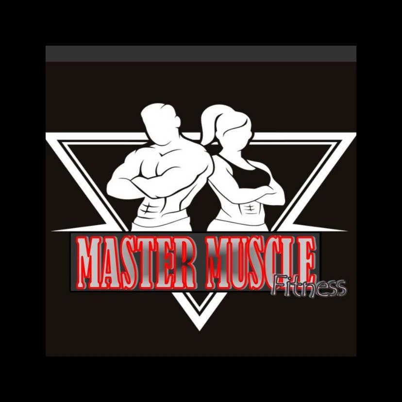

  

<h1 align="center">Master Muscle</h1>

## Table of Contents

- [Creator](#creator)
- [Short Overview](#short-overview)
- [Frameworks & Libraries Used](#frameworks--libraries-used)
- [AI Usage Documentation](#use-of-ai-tools)

---

## Creator
This project is created by **Ian Jude Cagalawam Fabila** of BSIT-3B as a partial requirement for the course WS-101.

## Short Overview
This project was created using the Tailwind Framework with the sole purpose of advertising the Master Muscle Gym. The website includes information about the gym, its services, and contact information.

## Frameworks & Libraries Used
This project utilizes the following technologies to deliver a responsive, modern, and interactive user experience:
* **Tailwind CSS:** A utility-first CSS framework used for styling the entire website rapidly and maintaining a consistent design system.
* **Flowbite:** A UI component library built on top of Tailwind CSS, used for interactive elements like the mobile hamburger dropdown menu and image carousels.
* **AOS (Animate On Scroll):** A lightweight JavaScript library that powers the smooth fade-up and slide-in animations triggered as the user scrolls down the page.
* **FontAwesome:** A widely used icon library providing the crisp vector icons seen throughout the site (e.g., checkmarks, dumbbells, phone symbols, and social media links).

## Use of AI Tools
This document outlines how AI (Gemini) was utilized during the development of the Master Muscle website to assist with coding, debugging, and styling.

### 1. Implementing Website Animations
**Purpose:** To learn how to add smooth scroll animations to the website elements to make the user experience more dynamic.
 
**Prompt Used:**
> "How do I create animations for my website so that when its opened it will have animation"

**How it was applied:** The AI suggested using the AOS (Animate On Scroll) library. I implemented this by adding the required CDN links to the HTML files, applying attributes like `data-aos="fade-up"` and `data-aos-delay` to various UI components (like the pricing cards and equipment grid), and initializing the script at the bottom of the pages.

### 2. Fixing and Customizing the Carousel
**Purpose:** To troubleshoot a glitchy Flowbite carousel and convert its default sideways sliding animation into a seamless fade transition.
 
**Prompt Used:**
> "Fix this block of code for a carousel because the animation is glitchy, make it fade and not move sideways when clicking on the next image"

**How it was applied:** The AI provided a custom Vanilla JavaScript solution to override the default sliding behavior. I applied this script to the `About.html` page, where it dynamically toggles Tailwind CSS classes (switching between `opacity-0`/`z-0` and `opacity-100`/`z-10`) to create a smooth, custom cross-fade effect between the images.

### 3. Adjusting Image Opacity for Text Readability
**Purpose:** To figure out the best CSS approach to darken a background image so that the overlaying text stands out clearly.
 
**Prompt Used:**
> "How do I make this image darker for my text to be seen better"

**How it was applied:** The AI pointed me to exactly where I should change the opacity number for the picture in the code.

### 4. Spacing, Padding, and Margin Inconcistencies
**Purpose:** To figure out the best CSS approach to darken a background image so that the overlaying text stands out clearly.
 
**Prompt Used:**
> "Fix the Spacing in (insert part of code here) so that (insert what needs to happen)"

**How it was applied:** The AI pointed out what properties of Inline tailwind css should i tweak and add so that I can customize it to my own specifications.

### 5. Fixing HTML Syntax Errors and Broken Layouts
**Purpose:** To debug sections of the website where the layout was breaking or elements were bleeding into each other.
 
**Prompt Used:** 
> "fix the personal trqiners"

**How it was applied:** The AI identified missing closing `
` and `</a>` tags in the HTML that were breaking the grid structure, and provided the corrected code blocks to restore the layout.

### 6. Standardizing the Navigation Bar and Mobile Menu
**Purpose:** To make the header consistent across all 4 pages and fix an issue where opening the mobile menu pushed the rest of the website down.
 
**Prompt Used:** 
> "can you make the spacing of the header on all 4 consistent, give me the codes of the header part"

**How it was applied:** The AI provided a standardized header code block using Tailwind's `absolute top-full` positioning for the mobile dropdown, ensuring it smoothly overlays the page content instead of disrupting the document flow.

### 7. Expanding Responsive Grids & Generating Structure
**Purpose:** To expand the "Arsenal/Facilities" section from a single row into a full 3-row grid for better desktop viewing.
 
**Prompt Used:** 
> "can you make the pictures on the arsenal have like 3 rows? give full code"

**How it was applied:** The AI generated 6 additional HTML equipment cards that perfectly matched the existing Tailwind classes, hover effects (`group-hover:scale-110`), and AOS scroll animations to create a clean 3x3 grid.

### 8. Adjusting Image Aspect Ratios
**Purpose:** To make the equipment images taller and more prominent on the screen rather than wide and narrow.
 
**Prompt Used:** 
> "make the pictures at the facilities have higher height"

**How it was applied:** The AI suggested replacing Tailwind's `aspect-video` (16:9 ratio) utility class with `aspect-square` (1:1 ratio) to instantly increase the vertical height of all images in the grid while keeping them responsive.
